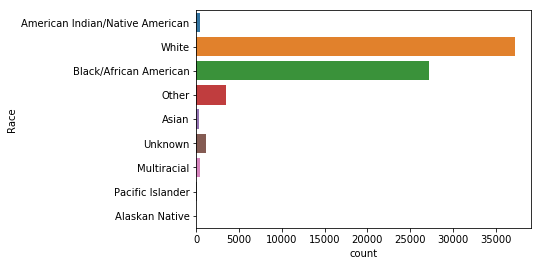
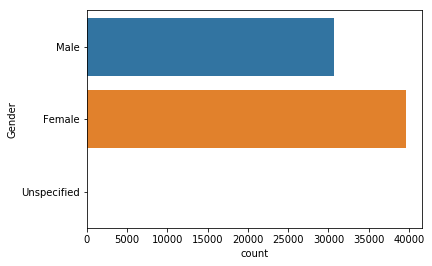
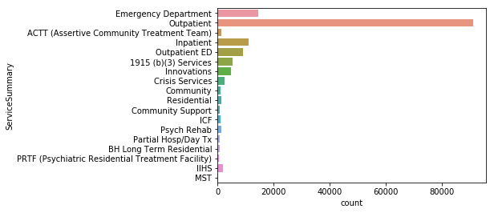
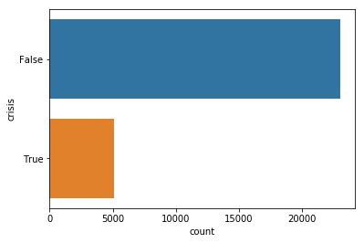

```python
# data analysis and wrangling
import pandas as pd
import numpy as np
import random as rnd

# visualization
import seaborn as sns
import matplotlib.pyplot as plt
%matplotlib inline
# machine learning
from sklearn.linear_model import LogisticRegression
from sklearn.svm import SVC, LinearSVC
from sklearn.ensemble import RandomForestClassifier
from sklearn.neighbors import KNeighborsClassifier
from sklearn.naive_bayes import GaussianNB
from sklearn.linear_model import Perceptron
from sklearn.linear_model import SGDClassifier
from sklearn.tree import DecisionTreeClassifier
from sklearn import preprocessing
from sklearn.metrics import confusion_matrix
```


```python
outcomes_train = pd.read_csv('outcomes_training.csv')
```


```python
outcomes_perHackID = pd.read_csv('perHackID.csv')
```


```python
outcomes_train.describe()

```


<div>
<style>
    .dataframe thead tr:only-child th {
        text-align: right;
    }

    .dataframe thead th {
        text-align: left;
    }

    .dataframe tbody tr th {
        vertical-align: top;
    }
</style>
<table border="1" class="dataframe">
  <thead>
    <tr style="text-align: right;">
      <th></th>
      <th>HackID</th>
    </tr>
  </thead>
  <tbody>
    <tr>
      <th>count</th>
      <td>2.812300e+04</td>
    </tr>
    <tr>
      <th>mean</th>
      <td>2.550245e+07</td>
    </tr>
    <tr>
      <th>std</th>
      <td>1.564099e+07</td>
    </tr>
    <tr>
      <th>min</th>
      <td>5.180000e+02</td>
    </tr>
    <tr>
      <th>25%</th>
      <td>1.226628e+07</td>
    </tr>
    <tr>
      <th>50%</th>
      <td>2.749411e+07</td>
    </tr>
    <tr>
      <th>75%</th>
      <td>4.132965e+07</td>
    </tr>
    <tr>
      <th>max</th>
      <td>5.074435e+07</td>
    </tr>
  </tbody>
</table>
</div>


```python
health_consumer = pd.read_excel('healthdata/Consumer_data.xlsx')
```


```python
bh_health_claims= pd.read_excel('healthdata/BH_claims_Hackathon.xlsx')
```


```python
print(outcomes_perHackID.columns.values)
```

    ['HackID' 'HackCounty' 'Gender' 'Race' 'Ethnicity' 'A00-B99' 'C00-D49'
     'D50-D89' 'E00-E89' 'F01-F99' 'G00-G99' 'H00-H59' 'H60-H95' 'I00-I99'
     'J00-J99' 'K00-K95' 'L00-L99' 'M00-M99' 'N00-N99' 'O00-O9A' 'P00-P96'
     'Q00-Q99' 'R00-R99' 'S00-T88' 'Z00-Z99']


```python
consumer_bh_health_claims =pd.merge(health_consumer, bh_health_claims, left_on='HackID', right_on='HackID')

```


```python
outcomes_training= pd.merge(outcomes_train, outcomes_perHackID, left_on='HackID', right_on='HackID')
```

# Patents Race distribution


```python

sns.countplot(y='Race', data=health_consumer)
```


    <matplotlib.axes._subplots.AxesSubplot at 0x119fb2668>





# Patent Gendar Distrubution


```python

sns.countplot(y='Gender', data=health_consumer)
```


    <matplotlib.axes._subplots.AxesSubplot at 0x120e35208>





# Patent  Distrubution  based on ServiceSummary


```python

sns.countplot(y='ServiceSummary', data=bh_health_claims)
```


    <matplotlib.axes._subplots.AxesSubplot at 0x120e36630>





```python
outcomes_training.head()
```


<div>
<style>
    .dataframe thead tr:only-child th {
        text-align: right;
    }

    .dataframe thead th {
        text-align: left;
    }

    .dataframe tbody tr th {
        vertical-align: top;
    }
</style>
<table border="1" class="dataframe">
  <thead>
    <tr style="text-align: right;">
      <th></th>
      <th>HackID</th>
      <th>crisis</th>
      <th>HackCounty</th>
      <th>Gender</th>
      <th>Race</th>
      <th>Ethnicity</th>
      <th>A00-B99</th>
      <th>C00-D49</th>
      <th>D50-D89</th>
      <th>E00-E89</th>
      <th>...</th>
      <th>K00-K95</th>
      <th>L00-L99</th>
      <th>M00-M99</th>
      <th>N00-N99</th>
      <th>O00-O9A</th>
      <th>P00-P96</th>
      <th>Q00-Q99</th>
      <th>R00-R99</th>
      <th>S00-T88</th>
      <th>Z00-Z99</th>
    </tr>
  </thead>
  <tbody>
    <tr>
      <th>0</th>
      <td>14902416</td>
      <td>False</td>
      <td>871</td>
      <td>Male</td>
      <td>Black/African American</td>
      <td>N= Not Hispanic Origin</td>
      <td>0</td>
      <td>0</td>
      <td>0</td>
      <td>0</td>
      <td>...</td>
      <td>0</td>
      <td>0</td>
      <td>0</td>
      <td>0</td>
      <td>0</td>
      <td>0</td>
      <td>0</td>
      <td>0</td>
      <td>0</td>
      <td>1</td>
    </tr>
    <tr>
      <th>1</th>
      <td>833721</td>
      <td>False</td>
      <td>134</td>
      <td>Female</td>
      <td>Black/African American</td>
      <td>N= Not Hispanic Origin</td>
      <td>0</td>
      <td>0</td>
      <td>0</td>
      <td>0</td>
      <td>...</td>
      <td>0</td>
      <td>0</td>
      <td>6</td>
      <td>0</td>
      <td>0</td>
      <td>0</td>
      <td>0</td>
      <td>0</td>
      <td>18</td>
      <td>17</td>
    </tr>
    <tr>
      <th>2</th>
      <td>33584419</td>
      <td>False</td>
      <td>6834</td>
      <td>Female</td>
      <td>White</td>
      <td>N= Not Hispanic Origin</td>
      <td>0</td>
      <td>0</td>
      <td>0</td>
      <td>0</td>
      <td>...</td>
      <td>0</td>
      <td>0</td>
      <td>3</td>
      <td>0</td>
      <td>0</td>
      <td>0</td>
      <td>0</td>
      <td>98</td>
      <td>0</td>
      <td>2</td>
    </tr>
    <tr>
      <th>3</th>
      <td>44997883</td>
      <td>False</td>
      <td>6968</td>
      <td>Male</td>
      <td>Black/African American</td>
      <td>U= Unknown</td>
      <td>0</td>
      <td>0</td>
      <td>0</td>
      <td>5</td>
      <td>...</td>
      <td>0</td>
      <td>0</td>
      <td>0</td>
      <td>0</td>
      <td>0</td>
      <td>0</td>
      <td>0</td>
      <td>0</td>
      <td>0</td>
      <td>0</td>
    </tr>
    <tr>
      <th>4</th>
      <td>30329566</td>
      <td>False</td>
      <td>6834</td>
      <td>Male</td>
      <td>Black/African American</td>
      <td>U= Unknown</td>
      <td>1</td>
      <td>0</td>
      <td>0</td>
      <td>0</td>
      <td>...</td>
      <td>0</td>
      <td>0</td>
      <td>5</td>
      <td>0</td>
      <td>0</td>
      <td>0</td>
      <td>0</td>
      <td>18</td>
      <td>3</td>
      <td>9</td>
    </tr>
  </tbody>
</table>
<p>5 rows × 26 columns</p>
</div>


```python

sns.countplot(y='crisis', data=outcomes_training)
```


    <matplotlib.axes._subplots.AxesSubplot at 0x1230cae80>





```python
outcomes_training.head(50)
```


<div>
<style>
    .dataframe thead tr:only-child th {
        text-align: right;
    }

    .dataframe thead th {
        text-align: left;
    }

    .dataframe tbody tr th {
        vertical-align: top;
    }
</style>
<table border="1" class="dataframe">
  <thead>
    <tr style="text-align: right;">
      <th></th>
      <th>HackID</th>
      <th>crisis</th>
      <th>HackCounty</th>
      <th>Gender</th>
      <th>Race</th>
      <th>Ethnicity</th>
      <th>A00-B99</th>
      <th>C00-D49</th>
      <th>D50-D89</th>
      <th>E00-E89</th>
      <th>...</th>
      <th>K00-K95</th>
      <th>L00-L99</th>
      <th>M00-M99</th>
      <th>N00-N99</th>
      <th>O00-O9A</th>
      <th>P00-P96</th>
      <th>Q00-Q99</th>
      <th>R00-R99</th>
      <th>S00-T88</th>
      <th>Z00-Z99</th>
    </tr>
  </thead>
  <tbody>
    <tr>
      <th>0</th>
      <td>14902416</td>
      <td>False</td>
      <td>871</td>
      <td>Male</td>
      <td>Black/African American</td>
      <td>N= Not Hispanic Origin</td>
      <td>0</td>
      <td>0</td>
      <td>0</td>
      <td>0</td>
      <td>...</td>
      <td>0</td>
      <td>0</td>
      <td>0</td>
      <td>0</td>
      <td>0</td>
      <td>0</td>
      <td>0</td>
      <td>0</td>
      <td>0</td>
      <td>1</td>
    </tr>
    <tr>
      <th>1</th>
      <td>833721</td>
      <td>False</td>
      <td>134</td>
      <td>Female</td>
      <td>Black/African American</td>
      <td>N= Not Hispanic Origin</td>
      <td>0</td>
      <td>0</td>
      <td>0</td>
      <td>0</td>
      <td>...</td>
      <td>0</td>
      <td>0</td>
      <td>6</td>
      <td>0</td>
      <td>0</td>
      <td>0</td>
      <td>0</td>
      <td>0</td>
      <td>18</td>
      <td>17</td>
    </tr>
    <tr>
      <th>2</th>
      <td>33584419</td>
      <td>False</td>
      <td>6834</td>
      <td>Female</td>
      <td>White</td>
      <td>N= Not Hispanic Origin</td>
      <td>0</td>
      <td>0</td>
      <td>0</td>
      <td>0</td>
      <td>...</td>
      <td>0</td>
      <td>0</td>
      <td>3</td>
      <td>0</td>
      <td>0</td>
      <td>0</td>
      <td>0</td>
      <td>98</td>
      <td>0</td>
      <td>2</td>
    </tr>
    <tr>
      <th>3</th>
      <td>44997883</td>
      <td>False</td>
      <td>6968</td>
      <td>Male</td>
      <td>Black/African American</td>
      <td>U= Unknown</td>
      <td>0</td>
      <td>0</td>
      <td>0</td>
      <td>5</td>
      <td>...</td>
      <td>0</td>
      <td>0</td>
      <td>0</td>
      <td>0</td>
      <td>0</td>
      <td>0</td>
      <td>0</td>
      <td>0</td>
      <td>0</td>
      <td>0</td>
    </tr>
    <tr>
      <th>4</th>
      <td>30329566</td>
      <td>False</td>
      <td>6834</td>
      <td>Male</td>
      <td>Black/African American</td>
      <td>U= Unknown</td>
      <td>1</td>
      <td>0</td>
      <td>0</td>
      <td>0</td>
      <td>...</td>
      <td>0</td>
      <td>0</td>
      <td>5</td>
      <td>0</td>
      <td>0</td>
      <td>0</td>
      <td>0</td>
      <td>18</td>
      <td>3</td>
      <td>9</td>
    </tr>
    <tr>
      <th>5</th>
      <td>37131868</td>
      <td>False</td>
      <td>67</td>
      <td>Male</td>
      <td>Black/African American</td>
      <td>N= Not Hispanic Origin</td>
      <td>0</td>
      <td>0</td>
      <td>0</td>
      <td>0</td>
      <td>...</td>
      <td>0</td>
      <td>0</td>
      <td>0</td>
      <td>2</td>
      <td>0</td>
      <td>0</td>
      <td>0</td>
      <td>0</td>
      <td>0</td>
      <td>0</td>
    </tr>
    <tr>
      <th>6</th>
      <td>17419415</td>
      <td>False</td>
      <td>670</td>
      <td>Male</td>
      <td>White</td>
      <td>N= Not Hispanic Origin</td>
      <td>0</td>
      <td>0</td>
      <td>0</td>
      <td>0</td>
      <td>...</td>
      <td>0</td>
      <td>0</td>
      <td>0</td>
      <td>0</td>
      <td>0</td>
      <td>0</td>
      <td>0</td>
      <td>0</td>
      <td>0</td>
      <td>0</td>
    </tr>
    <tr>
      <th>7</th>
      <td>15895311</td>
      <td>True</td>
      <td>871</td>
      <td>Female</td>
      <td>White</td>
      <td>N= Not Hispanic Origin</td>
      <td>0</td>
      <td>0</td>
      <td>0</td>
      <td>0</td>
      <td>...</td>
      <td>0</td>
      <td>3</td>
      <td>13</td>
      <td>0</td>
      <td>0</td>
      <td>0</td>
      <td>0</td>
      <td>1</td>
      <td>16</td>
      <td>3</td>
    </tr>
    <tr>
      <th>8</th>
      <td>45094120</td>
      <td>False</td>
      <td>6968</td>
      <td>Female</td>
      <td>White</td>
      <td>N= Not Hispanic Origin</td>
      <td>0</td>
      <td>0</td>
      <td>0</td>
      <td>0</td>
      <td>...</td>
      <td>0</td>
      <td>7</td>
      <td>0</td>
      <td>0</td>
      <td>0</td>
      <td>0</td>
      <td>0</td>
      <td>1</td>
      <td>0</td>
      <td>7</td>
    </tr>
    <tr>
      <th>9</th>
      <td>16370909</td>
      <td>False</td>
      <td>804</td>
      <td>Female</td>
      <td>White</td>
      <td>N= Not Hispanic Origin</td>
      <td>0</td>
      <td>0</td>
      <td>0</td>
      <td>0</td>
      <td>...</td>
      <td>1</td>
      <td>0</td>
      <td>0</td>
      <td>0</td>
      <td>0</td>
      <td>0</td>
      <td>0</td>
      <td>0</td>
      <td>0</td>
      <td>4</td>
    </tr>
    <tr>
      <th>10</th>
      <td>31770420</td>
      <td>False</td>
      <td>6834</td>
      <td>Male</td>
      <td>Black/African American</td>
      <td>N= Not Hispanic Origin</td>
      <td>0</td>
      <td>0</td>
      <td>0</td>
      <td>0</td>
      <td>...</td>
      <td>0</td>
      <td>0</td>
      <td>0</td>
      <td>3</td>
      <td>0</td>
      <td>0</td>
      <td>0</td>
      <td>0</td>
      <td>0</td>
      <td>0</td>
    </tr>
    <tr>
      <th>11</th>
      <td>1088318</td>
      <td>False</td>
      <td>0</td>
      <td>Female</td>
      <td>Black/African American</td>
      <td>N= Not Hispanic Origin</td>
      <td>0</td>
      <td>0</td>
      <td>0</td>
      <td>0</td>
      <td>...</td>
      <td>1</td>
      <td>0</td>
      <td>32</td>
      <td>3</td>
      <td>0</td>
      <td>0</td>
      <td>0</td>
      <td>4</td>
      <td>2</td>
      <td>12</td>
    </tr>
    <tr>
      <th>12</th>
      <td>47097559</td>
      <td>True</td>
      <td>7035</td>
      <td>Female</td>
      <td>Black/African American</td>
      <td>N= Not Hispanic Origin</td>
      <td>0</td>
      <td>0</td>
      <td>0</td>
      <td>0</td>
      <td>...</td>
      <td>36</td>
      <td>1</td>
      <td>3</td>
      <td>0</td>
      <td>0</td>
      <td>0</td>
      <td>0</td>
      <td>16</td>
      <td>7</td>
      <td>2</td>
    </tr>
    <tr>
      <th>13</th>
      <td>46872932</td>
      <td>False</td>
      <td>6968</td>
      <td>Female</td>
      <td>White</td>
      <td>U= Unknown</td>
      <td>0</td>
      <td>0</td>
      <td>0</td>
      <td>0</td>
      <td>...</td>
      <td>0</td>
      <td>0</td>
      <td>0</td>
      <td>0</td>
      <td>0</td>
      <td>0</td>
      <td>1</td>
      <td>2</td>
      <td>0</td>
      <td>0</td>
    </tr>
    <tr>
      <th>14</th>
      <td>7867902</td>
      <td>False</td>
      <td>134</td>
      <td>Male</td>
      <td>White</td>
      <td>N= Not Hispanic Origin</td>
      <td>0</td>
      <td>0</td>
      <td>0</td>
      <td>2</td>
      <td>...</td>
      <td>1</td>
      <td>24</td>
      <td>61</td>
      <td>0</td>
      <td>0</td>
      <td>0</td>
      <td>0</td>
      <td>15</td>
      <td>0</td>
      <td>0</td>
    </tr>
    <tr>
      <th>15</th>
      <td>749620</td>
      <td>False</td>
      <td>6834</td>
      <td>Female</td>
      <td>Black/African American</td>
      <td>N= Not Hispanic Origin</td>
      <td>0</td>
      <td>0</td>
      <td>0</td>
      <td>0</td>
      <td>...</td>
      <td>0</td>
      <td>0</td>
      <td>3</td>
      <td>2</td>
      <td>0</td>
      <td>0</td>
      <td>0</td>
      <td>18</td>
      <td>0</td>
      <td>7</td>
    </tr>
    <tr>
      <th>16</th>
      <td>40656340</td>
      <td>False</td>
      <td>6834</td>
      <td>Male</td>
      <td>Black/African American</td>
      <td>N= Not Hispanic Origin</td>
      <td>0</td>
      <td>0</td>
      <td>0</td>
      <td>76</td>
      <td>...</td>
      <td>0</td>
      <td>0</td>
      <td>0</td>
      <td>0</td>
      <td>0</td>
      <td>0</td>
      <td>0</td>
      <td>4</td>
      <td>0</td>
      <td>15</td>
    </tr>
    <tr>
      <th>17</th>
      <td>20462221</td>
      <td>False</td>
      <td>670</td>
      <td>Female</td>
      <td>White</td>
      <td>N= Not Hispanic Origin</td>
      <td>15</td>
      <td>0</td>
      <td>0</td>
      <td>0</td>
      <td>...</td>
      <td>44</td>
      <td>0</td>
      <td>1</td>
      <td>0</td>
      <td>0</td>
      <td>0</td>
      <td>0</td>
      <td>30</td>
      <td>0</td>
      <td>3</td>
    </tr>
    <tr>
      <th>18</th>
      <td>42271279</td>
      <td>False</td>
      <td>603</td>
      <td>Male</td>
      <td>Black/African American</td>
      <td>N= Not Hispanic Origin</td>
      <td>0</td>
      <td>0</td>
      <td>0</td>
      <td>0</td>
      <td>...</td>
      <td>0</td>
      <td>0</td>
      <td>0</td>
      <td>0</td>
      <td>0</td>
      <td>0</td>
      <td>0</td>
      <td>0</td>
      <td>0</td>
      <td>1</td>
    </tr>
    <tr>
      <th>19</th>
      <td>36371481</td>
      <td>False</td>
      <td>335</td>
      <td>Female</td>
      <td>White</td>
      <td>N= Not Hispanic Origin</td>
      <td>0</td>
      <td>0</td>
      <td>6</td>
      <td>0</td>
      <td>...</td>
      <td>0</td>
      <td>0</td>
      <td>0</td>
      <td>2</td>
      <td>0</td>
      <td>0</td>
      <td>0</td>
      <td>22</td>
      <td>7</td>
      <td>1</td>
    </tr>
    <tr>
      <th>20</th>
      <td>49397516</td>
      <td>True</td>
      <td>6968</td>
      <td>Female</td>
      <td>White</td>
      <td>N= Not Hispanic Origin</td>
      <td>0</td>
      <td>0</td>
      <td>0</td>
      <td>4</td>
      <td>...</td>
      <td>0</td>
      <td>0</td>
      <td>6</td>
      <td>0</td>
      <td>0</td>
      <td>0</td>
      <td>0</td>
      <td>42</td>
      <td>10</td>
      <td>1</td>
    </tr>
    <tr>
      <th>21</th>
      <td>40899800</td>
      <td>False</td>
      <td>6834</td>
      <td>Female</td>
      <td>White</td>
      <td>N= Not Hispanic Origin</td>
      <td>0</td>
      <td>0</td>
      <td>0</td>
      <td>0</td>
      <td>...</td>
      <td>0</td>
      <td>0</td>
      <td>4</td>
      <td>0</td>
      <td>0</td>
      <td>0</td>
      <td>0</td>
      <td>13</td>
      <td>1</td>
      <td>0</td>
    </tr>
    <tr>
      <th>22</th>
      <td>44089200</td>
      <td>False</td>
      <td>7035</td>
      <td>Female</td>
      <td>Black/African American</td>
      <td>N= Not Hispanic Origin</td>
      <td>0</td>
      <td>0</td>
      <td>0</td>
      <td>0</td>
      <td>...</td>
      <td>0</td>
      <td>0</td>
      <td>0</td>
      <td>0</td>
      <td>0</td>
      <td>0</td>
      <td>0</td>
      <td>0</td>
      <td>0</td>
      <td>0</td>
    </tr>
    <tr>
      <th>23</th>
      <td>45803743</td>
      <td>False</td>
      <td>6968</td>
      <td>Male</td>
      <td>Other</td>
      <td>H= Hispanic, Other</td>
      <td>0</td>
      <td>0</td>
      <td>0</td>
      <td>9</td>
      <td>...</td>
      <td>0</td>
      <td>0</td>
      <td>0</td>
      <td>0</td>
      <td>0</td>
      <td>0</td>
      <td>0</td>
      <td>0</td>
      <td>0</td>
      <td>0</td>
    </tr>
    <tr>
      <th>24</th>
      <td>5325040</td>
      <td>False</td>
      <td>134</td>
      <td>Female</td>
      <td>Black/African American</td>
      <td>N= Not Hispanic Origin</td>
      <td>0</td>
      <td>0</td>
      <td>0</td>
      <td>0</td>
      <td>...</td>
      <td>0</td>
      <td>0</td>
      <td>0</td>
      <td>3</td>
      <td>0</td>
      <td>0</td>
      <td>0</td>
      <td>0</td>
      <td>0</td>
      <td>1</td>
    </tr>
    <tr>
      <th>25</th>
      <td>13402288</td>
      <td>False</td>
      <td>603</td>
      <td>Female</td>
      <td>Black/African American</td>
      <td>N= Not Hispanic Origin</td>
      <td>1</td>
      <td>375</td>
      <td>0</td>
      <td>0</td>
      <td>...</td>
      <td>0</td>
      <td>0</td>
      <td>0</td>
      <td>0</td>
      <td>0</td>
      <td>0</td>
      <td>0</td>
      <td>18</td>
      <td>0</td>
      <td>0</td>
    </tr>
    <tr>
      <th>26</th>
      <td>39414102</td>
      <td>True</td>
      <td>6834</td>
      <td>Female</td>
      <td>Black/African American</td>
      <td>N= Not Hispanic Origin</td>
      <td>0</td>
      <td>0</td>
      <td>0</td>
      <td>0</td>
      <td>...</td>
      <td>0</td>
      <td>0</td>
      <td>0</td>
      <td>7</td>
      <td>0</td>
      <td>0</td>
      <td>0</td>
      <td>0</td>
      <td>0</td>
      <td>0</td>
    </tr>
    <tr>
      <th>27</th>
      <td>394642</td>
      <td>False</td>
      <td>268</td>
      <td>Female</td>
      <td>White</td>
      <td>N= Not Hispanic Origin</td>
      <td>0</td>
      <td>0</td>
      <td>0</td>
      <td>0</td>
      <td>...</td>
      <td>0</td>
      <td>3</td>
      <td>2</td>
      <td>0</td>
      <td>0</td>
      <td>0</td>
      <td>0</td>
      <td>0</td>
      <td>0</td>
      <td>3</td>
    </tr>
    <tr>
      <th>28</th>
      <td>7288852</td>
      <td>True</td>
      <td>67</td>
      <td>Male</td>
      <td>White</td>
      <td>N= Not Hispanic Origin</td>
      <td>0</td>
      <td>0</td>
      <td>0</td>
      <td>0</td>
      <td>...</td>
      <td>0</td>
      <td>0</td>
      <td>0</td>
      <td>0</td>
      <td>0</td>
      <td>0</td>
      <td>0</td>
      <td>57</td>
      <td>0</td>
      <td>5</td>
    </tr>
    <tr>
      <th>29</th>
      <td>18122082</td>
      <td>False</td>
      <td>0</td>
      <td>Female</td>
      <td>White</td>
      <td>N= Not Hispanic Origin</td>
      <td>0</td>
      <td>0</td>
      <td>0</td>
      <td>0</td>
      <td>...</td>
      <td>12</td>
      <td>0</td>
      <td>11</td>
      <td>0</td>
      <td>0</td>
      <td>0</td>
      <td>0</td>
      <td>157</td>
      <td>0</td>
      <td>2</td>
    </tr>
    <tr>
      <th>30</th>
      <td>34071561</td>
      <td>False</td>
      <td>6834</td>
      <td>Male</td>
      <td>Black/African American</td>
      <td>N= Not Hispanic Origin</td>
      <td>0</td>
      <td>0</td>
      <td>4</td>
      <td>1</td>
      <td>...</td>
      <td>0</td>
      <td>0</td>
      <td>0</td>
      <td>0</td>
      <td>0</td>
      <td>0</td>
      <td>0</td>
      <td>0</td>
      <td>0</td>
      <td>1</td>
    </tr>
    <tr>
      <th>31</th>
      <td>12275342</td>
      <td>False</td>
      <td>737</td>
      <td>Male</td>
      <td>White</td>
      <td>N= Not Hispanic Origin</td>
      <td>1</td>
      <td>0</td>
      <td>0</td>
      <td>0</td>
      <td>...</td>
      <td>0</td>
      <td>0</td>
      <td>0</td>
      <td>0</td>
      <td>0</td>
      <td>0</td>
      <td>0</td>
      <td>0</td>
      <td>0</td>
      <td>4</td>
    </tr>
    <tr>
      <th>32</th>
      <td>45687156</td>
      <td>False</td>
      <td>7102</td>
      <td>Male</td>
      <td>White</td>
      <td>N= Not Hispanic Origin</td>
      <td>0</td>
      <td>0</td>
      <td>0</td>
      <td>0</td>
      <td>...</td>
      <td>0</td>
      <td>0</td>
      <td>0</td>
      <td>0</td>
      <td>0</td>
      <td>0</td>
      <td>0</td>
      <td>1</td>
      <td>0</td>
      <td>0</td>
    </tr>
    <tr>
      <th>33</th>
      <td>28489408</td>
      <td>True</td>
      <td>6834</td>
      <td>Male</td>
      <td>Black/African American</td>
      <td>N= Not Hispanic Origin</td>
      <td>0</td>
      <td>0</td>
      <td>0</td>
      <td>0</td>
      <td>...</td>
      <td>0</td>
      <td>0</td>
      <td>27</td>
      <td>222</td>
      <td>0</td>
      <td>0</td>
      <td>0</td>
      <td>1</td>
      <td>8</td>
      <td>6</td>
    </tr>
    <tr>
      <th>34</th>
      <td>38706033</td>
      <td>True</td>
      <td>6834</td>
      <td>Female</td>
      <td>Other</td>
      <td>M=  Hispanic, Mexican American</td>
      <td>0</td>
      <td>0</td>
      <td>0</td>
      <td>0</td>
      <td>...</td>
      <td>0</td>
      <td>0</td>
      <td>0</td>
      <td>0</td>
      <td>0</td>
      <td>0</td>
      <td>0</td>
      <td>0</td>
      <td>10</td>
      <td>0</td>
    </tr>
    <tr>
      <th>35</th>
      <td>19722332</td>
      <td>False</td>
      <td>603</td>
      <td>Male</td>
      <td>White</td>
      <td>U= Unknown</td>
      <td>2</td>
      <td>0</td>
      <td>0</td>
      <td>0</td>
      <td>...</td>
      <td>0</td>
      <td>0</td>
      <td>0</td>
      <td>0</td>
      <td>0</td>
      <td>0</td>
      <td>0</td>
      <td>0</td>
      <td>0</td>
      <td>5</td>
    </tr>
    <tr>
      <th>36</th>
      <td>44022970</td>
      <td>False</td>
      <td>6968</td>
      <td>Male</td>
      <td>Black/African American</td>
      <td>N= Not Hispanic Origin</td>
      <td>29</td>
      <td>0</td>
      <td>1</td>
      <td>77</td>
      <td>...</td>
      <td>76</td>
      <td>0</td>
      <td>1</td>
      <td>300</td>
      <td>0</td>
      <td>0</td>
      <td>0</td>
      <td>69</td>
      <td>5</td>
      <td>6</td>
    </tr>
    <tr>
      <th>37</th>
      <td>43618190</td>
      <td>False</td>
      <td>6968</td>
      <td>Male</td>
      <td>Unknown</td>
      <td>N= Not Hispanic Origin</td>
      <td>0</td>
      <td>0</td>
      <td>0</td>
      <td>0</td>
      <td>...</td>
      <td>1</td>
      <td>1</td>
      <td>17</td>
      <td>0</td>
      <td>0</td>
      <td>0</td>
      <td>0</td>
      <td>1</td>
      <td>0</td>
      <td>0</td>
    </tr>
    <tr>
      <th>38</th>
      <td>44060673</td>
      <td>False</td>
      <td>6968</td>
      <td>Male</td>
      <td>Black/African American</td>
      <td>N= Not Hispanic Origin</td>
      <td>0</td>
      <td>0</td>
      <td>0</td>
      <td>0</td>
      <td>...</td>
      <td>0</td>
      <td>5</td>
      <td>0</td>
      <td>0</td>
      <td>0</td>
      <td>0</td>
      <td>0</td>
      <td>27</td>
      <td>0</td>
      <td>10</td>
    </tr>
    <tr>
      <th>39</th>
      <td>45761452</td>
      <td>False</td>
      <td>6968</td>
      <td>Female</td>
      <td>White</td>
      <td>U= Unknown</td>
      <td>0</td>
      <td>0</td>
      <td>0</td>
      <td>0</td>
      <td>...</td>
      <td>0</td>
      <td>0</td>
      <td>0</td>
      <td>0</td>
      <td>0</td>
      <td>0</td>
      <td>0</td>
      <td>8</td>
      <td>0</td>
      <td>0</td>
    </tr>
    <tr>
      <th>40</th>
      <td>44236645</td>
      <td>False</td>
      <td>6968</td>
      <td>Female</td>
      <td>Other</td>
      <td>P= Hispanic, Puerto Rican</td>
      <td>6</td>
      <td>0</td>
      <td>0</td>
      <td>6</td>
      <td>...</td>
      <td>0</td>
      <td>0</td>
      <td>14</td>
      <td>11</td>
      <td>0</td>
      <td>0</td>
      <td>0</td>
      <td>23</td>
      <td>0</td>
      <td>11</td>
    </tr>
    <tr>
      <th>41</th>
      <td>41908420</td>
      <td>True</td>
      <td>6834</td>
      <td>Female</td>
      <td>White</td>
      <td>N= Not Hispanic Origin</td>
      <td>0</td>
      <td>0</td>
      <td>0</td>
      <td>0</td>
      <td>...</td>
      <td>0</td>
      <td>0</td>
      <td>1</td>
      <td>11</td>
      <td>0</td>
      <td>0</td>
      <td>0</td>
      <td>0</td>
      <td>7</td>
      <td>2</td>
    </tr>
    <tr>
      <th>42</th>
      <td>19753782</td>
      <td>False</td>
      <td>0</td>
      <td>Male</td>
      <td>Black/African American</td>
      <td>N= Not Hispanic Origin</td>
      <td>0</td>
      <td>0</td>
      <td>0</td>
      <td>0</td>
      <td>...</td>
      <td>0</td>
      <td>0</td>
      <td>0</td>
      <td>0</td>
      <td>0</td>
      <td>0</td>
      <td>0</td>
      <td>0</td>
      <td>0</td>
      <td>7</td>
    </tr>
    <tr>
      <th>43</th>
      <td>37940318</td>
      <td>False</td>
      <td>6834</td>
      <td>Male</td>
      <td>Other</td>
      <td>U= Unknown</td>
      <td>59</td>
      <td>0</td>
      <td>0</td>
      <td>10</td>
      <td>...</td>
      <td>2</td>
      <td>26</td>
      <td>0</td>
      <td>18</td>
      <td>0</td>
      <td>0</td>
      <td>0</td>
      <td>12</td>
      <td>6</td>
      <td>13</td>
    </tr>
    <tr>
      <th>44</th>
      <td>19100843</td>
      <td>False</td>
      <td>0</td>
      <td>Female</td>
      <td>White</td>
      <td>N= Not Hispanic Origin</td>
      <td>0</td>
      <td>0</td>
      <td>0</td>
      <td>0</td>
      <td>...</td>
      <td>0</td>
      <td>0</td>
      <td>0</td>
      <td>0</td>
      <td>0</td>
      <td>0</td>
      <td>0</td>
      <td>0</td>
      <td>0</td>
      <td>3</td>
    </tr>
    <tr>
      <th>45</th>
      <td>2027637</td>
      <td>False</td>
      <td>134</td>
      <td>Female</td>
      <td>White</td>
      <td>N= Not Hispanic Origin</td>
      <td>0</td>
      <td>0</td>
      <td>0</td>
      <td>7</td>
      <td>...</td>
      <td>2</td>
      <td>0</td>
      <td>30</td>
      <td>7</td>
      <td>0</td>
      <td>0</td>
      <td>0</td>
      <td>96</td>
      <td>24</td>
      <td>2</td>
    </tr>
    <tr>
      <th>46</th>
      <td>7677981</td>
      <td>False</td>
      <td>0</td>
      <td>Male</td>
      <td>White</td>
      <td>N= Not Hispanic Origin</td>
      <td>12</td>
      <td>0</td>
      <td>0</td>
      <td>0</td>
      <td>...</td>
      <td>1</td>
      <td>0</td>
      <td>0</td>
      <td>0</td>
      <td>0</td>
      <td>0</td>
      <td>0</td>
      <td>1</td>
      <td>0</td>
      <td>0</td>
    </tr>
    <tr>
      <th>47</th>
      <td>48360887</td>
      <td>False</td>
      <td>6968</td>
      <td>Male</td>
      <td>White</td>
      <td>N= Not Hispanic Origin</td>
      <td>0</td>
      <td>0</td>
      <td>0</td>
      <td>0</td>
      <td>...</td>
      <td>0</td>
      <td>0</td>
      <td>0</td>
      <td>0</td>
      <td>0</td>
      <td>0</td>
      <td>0</td>
      <td>0</td>
      <td>0</td>
      <td>0</td>
    </tr>
    <tr>
      <th>48</th>
      <td>21208955</td>
      <td>False</td>
      <td>0</td>
      <td>Female</td>
      <td>White</td>
      <td>N= Not Hispanic Origin</td>
      <td>0</td>
      <td>0</td>
      <td>0</td>
      <td>0</td>
      <td>...</td>
      <td>0</td>
      <td>3</td>
      <td>1</td>
      <td>1</td>
      <td>0</td>
      <td>0</td>
      <td>0</td>
      <td>7</td>
      <td>0</td>
      <td>10</td>
    </tr>
    <tr>
      <th>49</th>
      <td>38145187</td>
      <td>False</td>
      <td>6834</td>
      <td>Male</td>
      <td>Black/African American</td>
      <td>N= Not Hispanic Origin</td>
      <td>0</td>
      <td>0</td>
      <td>0</td>
      <td>5</td>
      <td>...</td>
      <td>0</td>
      <td>0</td>
      <td>0</td>
      <td>1</td>
      <td>0</td>
      <td>0</td>
      <td>0</td>
      <td>30</td>
      <td>0</td>
      <td>21</td>
    </tr>
  </tbody>
</table>
<p>50 rows × 26 columns</p>
</div>


```python

```


```python
outcomes_testing = pd.read_csv('outcomes_testing1.csv')
```


```python
outcomes_testing.head()
```


<div>
<style>
    .dataframe thead tr:only-child th {
        text-align: right;
    }

    .dataframe thead th {
        text-align: left;
    }

    .dataframe tbody tr th {
        vertical-align: top;
    }
</style>
<table border="1" class="dataframe">
  <thead>
    <tr style="text-align: right;">
      <th></th>
      <th>HackID</th>
      <th>crisis</th>
    </tr>
  </thead>
  <tbody>
    <tr>
      <th>0</th>
      <td>9345793</td>
      <td>False</td>
    </tr>
    <tr>
      <th>1</th>
      <td>22046598</td>
      <td>False</td>
    </tr>
    <tr>
      <th>2</th>
      <td>15104510</td>
      <td>True</td>
    </tr>
    <tr>
      <th>3</th>
      <td>43754350</td>
      <td>False</td>
    </tr>
    <tr>
      <th>4</th>
      <td>1187071</td>
      <td>False</td>
    </tr>
  </tbody>
</table>
</div>


```python
outcomes_testing= pd.merge(outcomes_testing, outcomes_perHackID, left_on='HackID', right_on='HackID')
```


```python
outcomes_testing.head(0)
```


<div>
<style>
    .dataframe thead tr:only-child th {
        text-align: right;
    }

    .dataframe thead th {
        text-align: left;
    }

    .dataframe tbody tr th {
        vertical-align: top;
    }
</style>
<table border="1" class="dataframe">
  <thead>
    <tr style="text-align: right;">
      <th></th>
      <th>HackID</th>
      <th>crisis</th>
      <th>HackCounty</th>
      <th>Gender</th>
      <th>Race</th>
      <th>Ethnicity</th>
      <th>A00-B99</th>
      <th>C00-D49</th>
      <th>D50-D89</th>
      <th>E00-E89</th>
      <th>...</th>
      <th>K00-K95</th>
      <th>L00-L99</th>
      <th>M00-M99</th>
      <th>N00-N99</th>
      <th>O00-O9A</th>
      <th>P00-P96</th>
      <th>Q00-Q99</th>
      <th>R00-R99</th>
      <th>S00-T88</th>
      <th>Z00-Z99</th>
    </tr>
  </thead>
  <tbody>
  </tbody>
</table>
<p>0 rows × 26 columns</p>
</div>


```python
outcomes_testing.head()

```


<div>
<style>
    .dataframe thead tr:only-child th {
        text-align: right;
    }

    .dataframe thead th {
        text-align: left;
    }

    .dataframe tbody tr th {
        vertical-align: top;
    }
</style>
<table border="1" class="dataframe">
  <thead>
    <tr style="text-align: right;">
      <th></th>
      <th>HackID</th>
      <th>crisis</th>
      <th>HackCounty</th>
      <th>Gender</th>
      <th>Race</th>
      <th>Ethnicity</th>
      <th>A00-B99</th>
      <th>C00-D49</th>
      <th>D50-D89</th>
      <th>E00-E89</th>
      <th>...</th>
      <th>K00-K95</th>
      <th>L00-L99</th>
      <th>M00-M99</th>
      <th>N00-N99</th>
      <th>O00-O9A</th>
      <th>P00-P96</th>
      <th>Q00-Q99</th>
      <th>R00-R99</th>
      <th>S00-T88</th>
      <th>Z00-Z99</th>
    </tr>
  </thead>
  <tbody>
    <tr>
      <th>0</th>
      <td>9345793</td>
      <td>False</td>
      <td>335</td>
      <td>Female</td>
      <td>White</td>
      <td>N= Not Hispanic Origin</td>
      <td>5</td>
      <td>0</td>
      <td>0</td>
      <td>17</td>
      <td>...</td>
      <td>0</td>
      <td>0</td>
      <td>26</td>
      <td>0</td>
      <td>0</td>
      <td>0</td>
      <td>0</td>
      <td>38</td>
      <td>2</td>
      <td>3</td>
    </tr>
    <tr>
      <th>1</th>
      <td>22046598</td>
      <td>False</td>
      <td>268</td>
      <td>Male</td>
      <td>Other</td>
      <td>N= Not Hispanic Origin</td>
      <td>0</td>
      <td>0</td>
      <td>0</td>
      <td>0</td>
      <td>...</td>
      <td>0</td>
      <td>0</td>
      <td>0</td>
      <td>0</td>
      <td>0</td>
      <td>0</td>
      <td>0</td>
      <td>2</td>
      <td>0</td>
      <td>12</td>
    </tr>
    <tr>
      <th>2</th>
      <td>15104510</td>
      <td>True</td>
      <td>871</td>
      <td>Female</td>
      <td>White</td>
      <td>N= Not Hispanic Origin</td>
      <td>0</td>
      <td>45</td>
      <td>0</td>
      <td>0</td>
      <td>...</td>
      <td>2</td>
      <td>0</td>
      <td>0</td>
      <td>0</td>
      <td>0</td>
      <td>0</td>
      <td>0</td>
      <td>112</td>
      <td>0</td>
      <td>0</td>
    </tr>
    <tr>
      <th>3</th>
      <td>43754350</td>
      <td>False</td>
      <td>6968</td>
      <td>Female</td>
      <td>Multiracial</td>
      <td>M=  Hispanic, Mexican American</td>
      <td>0</td>
      <td>0</td>
      <td>0</td>
      <td>5</td>
      <td>...</td>
      <td>0</td>
      <td>0</td>
      <td>13</td>
      <td>8</td>
      <td>0</td>
      <td>0</td>
      <td>0</td>
      <td>13</td>
      <td>0</td>
      <td>0</td>
    </tr>
    <tr>
      <th>4</th>
      <td>1187071</td>
      <td>False</td>
      <td>134</td>
      <td>Male</td>
      <td>Black/African American</td>
      <td>N= Not Hispanic Origin</td>
      <td>0</td>
      <td>0</td>
      <td>0</td>
      <td>5</td>
      <td>...</td>
      <td>15</td>
      <td>0</td>
      <td>0</td>
      <td>0</td>
      <td>0</td>
      <td>0</td>
      <td>1</td>
      <td>0</td>
      <td>0</td>
      <td>2</td>
    </tr>
  </tbody>
</table>
<p>5 rows × 26 columns</p>
</div>


```python
X_train1 = outcomes_training.drop("crisis", axis=1)
X_train = X_train1.drop("HackID", axis=1)
Y_train = outcomes_training["crisis"]
X_test1  = outcomes_testing.drop("crisis", axis=1)
X_test  = X_test1.drop("HackID", axis=1)
X_train.shape, Y_train.shape, X_test.shape
```


    ((28123, 24), (28123,), (21093, 24))


```python
le = preprocessing.LabelEncoder()
X_train = X_train.apply(le.fit_transform)
X_test = X_test.apply(le.fit_transform)
```


```python
logreg = LogisticRegression()
logreg.fit(X_train, Y_train)
Y_pred = logreg.predict(X_test)
acc_log = round(logreg.score(X_train, Y_train) * 100, 2)
acc_log
```


    82.010000000000005


```python
# Support Vector Machines

svc = SVC()
svc.fit(X_train, Y_train)
Y_pred = svc.predict(X_test)
acc_svc = round(svc.score(X_train, Y_train) * 100, 2)
acc_svc
```


    92.560000000000002


```python
knn = KNeighborsClassifier(n_neighbors = 3)
knn.fit(X_train, Y_train)
Y_pred = knn.predict(X_test)
acc_knn = round(knn.score(X_train, Y_train) * 100, 2)
acc_knn
```


    86.379999999999995


```python
# Gaussian Naive Bayes
gaussian = GaussianNB()
gaussian.fit(X_train, Y_train)
Y_pred = gaussian.predict(X_test)
acc_gaussian = round(gaussian.score(X_train, Y_train) * 100, 2)
acc_gaussian
```


    76.519999999999996


```python
# Perceptron

perceptron = Perceptron()
perceptron.fit(X_train, Y_train)
Y_pred = perceptron.predict(X_test)
acc_perceptron = round(perceptron.score(X_train, Y_train) * 100, 2)
acc_perceptron
```

    /usr/local/lib/python3.6/site-packages/sklearn/linear_model/stochastic_gradient.py:128: FutureWarning: max_iter and tol parameters have been added in <class 'sklearn.linear_model.perceptron.Perceptron'> in 0.19. If both are left unset, they default to max_iter=5 and tol=None. If tol is not None, max_iter defaults to max_iter=1000. From 0.21, default max_iter will be 1000, and default tol will be 1e-3.
      "and default tol will be 1e-3." % type(self), FutureWarning)


    70.439999999999998


```python
# Linear SVC

linear_svc = LinearSVC()
linear_svc.fit(X_train, Y_train)
Y_pred = linear_svc.predict(X_test)
acc_linear_svc = round(linear_svc.score(X_train, Y_train) * 100, 2)
acc_linear_svc
```


    77.689999999999998


```python
# Stochastic Gradient Descent

sgd = SGDClassifier()
sgd.fit(X_train, Y_train)
Y_pred = sgd.predict(X_test)
acc_sgd = round(sgd.score(X_train, Y_train) * 100, 2)
acc_sgd
```

    /usr/local/lib/python3.6/site-packages/sklearn/linear_model/stochastic_gradient.py:128: FutureWarning: max_iter and tol parameters have been added in <class 'sklearn.linear_model.stochastic_gradient.SGDClassifier'> in 0.19. If both are left unset, they default to max_iter=5 and tol=None. If tol is not None, max_iter defaults to max_iter=1000. From 0.21, default max_iter will be 1000, and default tol will be 1e-3.
      "and default tol will be 1e-3." % type(self), FutureWarning)


    81.799999999999997


```python
X_train.head(28125).shape
```


```python
# Decision Tree
X_train.head(28123)
from sklearn import tree
decision_tree = DecisionTreeClassifier()
modelfit =decision_tree.fit(X_train, Y_train)
Y_pred = decision_tree.predict(X_test)
acc_decision_tree = round(decision_tree.score(X_train, Y_train) * 100, 2)
acc_decision_tree

```


    99.310000000000002


```python

```


```python
# Random Forest

random_forest = RandomForestClassifier(n_estimators=100)
model =random_forest.fit(X_train, Y_train)
Y_pred = random_forest.predict(X_test)
random_forest.score(X_train, Y_train)
acc_random_forest = round(random_forest.score(X_train, Y_train) * 100, 2)
acc_random_forest

```


    99.310000000000002


```python
tree.export_graphviz(decision_tree,
                feature_names=X_train.columns,
                filled=True,
                rounded=True)
```


```python

dot -Tpdf tree.dot -o crisis_classifier.pdf
```

# Predicting Crisis


```python
models = pd.DataFrame({
    'Model': ['Support Vector Machines', 'KNN', 'Logistic Regression', 
              'Random Forest', 'Naive Bayes', 'Perceptron', 
              'Stochastic Gradient Decent', 'Linear SVC', 
              'Decision Tree'],
    'Score': [acc_svc, acc_knn, acc_log, 
              acc_random_forest, acc_gaussian, acc_perceptron, 
              acc_sgd, acc_linear_svc, acc_decision_tree]})
models.sort_values(by='Score', ascending=False)
```


<div>
<style>
    .dataframe thead tr:only-child th {
        text-align: right;
    }

    .dataframe thead th {
        text-align: left;
    }

    .dataframe tbody tr th {
        vertical-align: top;
    }
</style>
<table border="1" class="dataframe">
  <thead>
    <tr style="text-align: right;">
      <th></th>
      <th>Model</th>
      <th>Score</th>
    </tr>
  </thead>
  <tbody>
    <tr>
      <th>3</th>
      <td>Random Forest</td>
      <td>99.31</td>
    </tr>
    <tr>
      <th>8</th>
      <td>Decision Tree</td>
      <td>99.31</td>
    </tr>
    <tr>
      <th>0</th>
      <td>Support Vector Machines</td>
      <td>92.56</td>
    </tr>
    <tr>
      <th>1</th>
      <td>KNN</td>
      <td>86.38</td>
    </tr>
    <tr>
      <th>2</th>
      <td>Logistic Regression</td>
      <td>82.01</td>
    </tr>
    <tr>
      <th>6</th>
      <td>Stochastic Gradient Decent</td>
      <td>81.80</td>
    </tr>
    <tr>
      <th>7</th>
      <td>Linear SVC</td>
      <td>77.69</td>
    </tr>
    <tr>
      <th>4</th>
      <td>Naive Bayes</td>
      <td>76.52</td>
    </tr>
    <tr>
      <th>5</th>
      <td>Perceptron</td>
      <td>70.44</td>
    </tr>
  </tbody>
</table>
</div>


```python

```


```python

```
